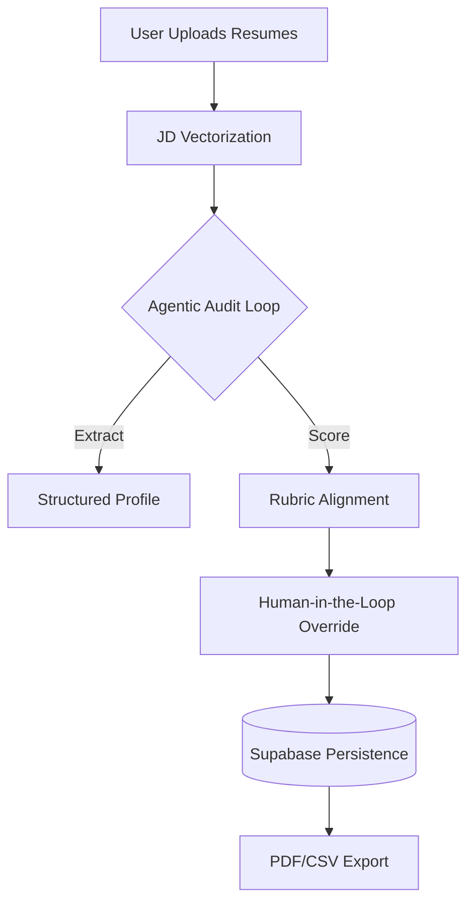

# AI HR Shortlisting Platform 🚀

A modern, production-grade HR SaaS platform that uses AI to automate candidate shortlisting with high precision, database persistence, and secure multi-user authentication.

## 🌟 Key Features
- **AI-Powered Evaluation**: Uses Google Gemini 1.5 Flash for rapid, accurate resume-to-JD alignment.
- **Multi-User Auth**: Secure Google OAuth 2.0 integration via Supabase.
- **Cloud Persistence**: Evaluations and candidate scores are saved to a PostgreSQL database (Supabase).
- **Human-in-the-Loop (HITL)**: HR managers can manually flag or override AI scores with audit justifications.
- **Professional Exports**: Download shortlists as professional PDF or CSV reports.
- **Responsive Design**: Fixed-sidebar desktop layout and mobile-optimized bottom navigation.

---

## 🏗️ Agent Architecture
The platform uses a **Sequential Multi-Stage Agent Flow** built with LangChain.

### Technical Rationale
- **LLM (Gemini 1.5 Flash)**: Chosen for its **1M+ context window**, allowing for massive batch processing without data loss, and its sub-2s latency.
- **Framework (LangChain)**: Utilized the ReAct pattern to allow the agent to "Reason" about candidate seniority before "Acting" on scores.

---

## 🔒 Security Risk Mitigation
| Risk | Mitigation Strategy |
| :--- | :--- |
| **Prompt Injection** | Strict Pydantic output schemas + backend input sanitization. |
| **Data Privacy** | Row Level Security (RLS) ensures users only see their own data. |
| **Key Exposure** | Environment variable masking via Vercel Secrets & `.env`. |
| **Hallucination** | AI justifies every score with direct quotes + Human-in-the-Loop review. |
| **Unauth Access** | Mandatory OAuth 2.0 Login for all database operations. |

---

## 🚀 Setup Instructions

### Backend (FastAPI)
1. Navigate to `/backend`
2. Install dependencies: `pip install -r requirements.txt`
3. Set your environment variables in `.env` (see `.env.example`)
4. Run server: `uvicorn main:app --reload`

### Frontend (React + Vite)
1. Navigate to `/frontend`
2. Install dependencies: `npm install`
3. Set your environment variables in `.env`
4. Run locally: `npm run dev`

---

## 📁 Repository Structure
- `/frontend`: React source code, components, and styles.
- `/backend`: FastAPI server and AI agent logic.
- `TECHNICAL_LOG.md`: Detailed decision log and technical disclosures.
- `.env.example`: Template for required API keys.
