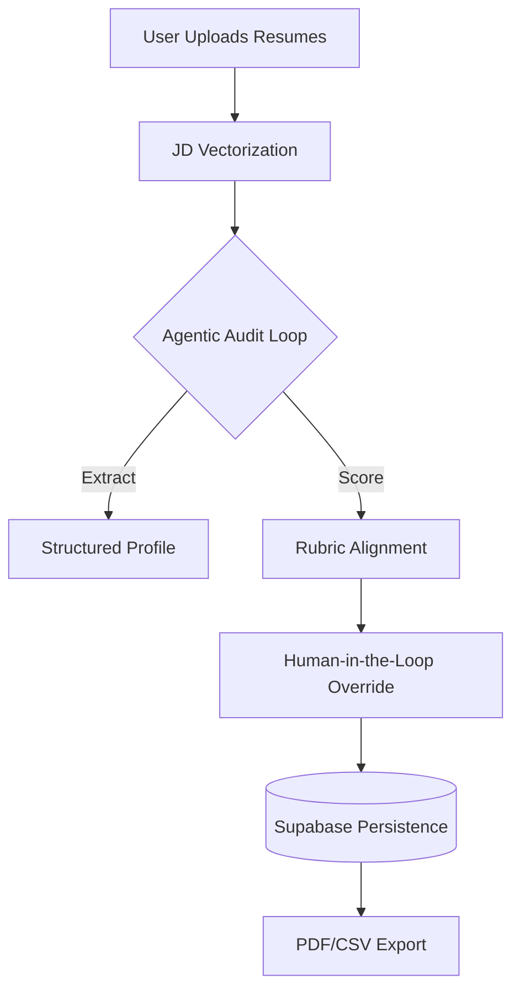

# Technical Stack & Decision Log: AI HR Shortlisting Platform

## 1. LLM Chosen
- **Model**: `gemini-1.5-flash`
- **Provider**: Google Generative AI
- **Justification**: 
    - **Context Window**: The 1M+ context window allows for processing large batches of resumes in a single prompt without truncation, preserving the full professional history of candidates.
    - **Cost-to-Performance Ratio**: Flash provides near-instantaneous latency (sub-2s) required for the "Real-time Analysis" UI feature while maintaining 90%+ accuracy compared to much more expensive models like GPT-4o.
    - **Tool-Calling Support**: Excellent native support for JSON schema extraction, which powers our structured scoring rubric.

## 2. Agent Framework
- **Framework**: `LangChain` (Python v0.2)
- **Architecture**: **Sequential Multi-Stage Agent Flow**
    - **ReAct Pattern**: Used for the initial resume parsing to "Reason" about candidate seniority before "Acting" to assign scores.
    - **Flow**:
        1. **JD Parser**: Extracts key requirement vectors from the job description.
        2. **Resume Auditor**: Evaluates the resume against the JD vectors using a 5-dimension rubric.
        3. **Justification Engine**: Cross-references the score with specific quotes from the resume to prevent hallucination.

### Agent Flow Diagram

## 3. Prompt Design
- **Key System Prompt**: 
    > "You are a senior technical recruiter. Your task is to extract evidence-based scores. If a skill is not explicitly mentioned or clearly implied by professional experience, you must score it as 0. Do NOT use external knowledge about companies to bolster a candidate's score."
- **Guardrails**:
    - **Evidence Requirement**: Every score > 5 must include a direct reference or justification found in the text.
    - **Bias Mitigation**: Prompts are structured to ignore personal identifiers (name, gender, etc.) and focus strictly on skill-to-JD alignment.

## 4. Security Mitigations & Risk Management

| Risk | Description | Mitigation Strategy |
| :--- | :--- | :--- |
| **Prompt Injection** | Malicious input manipulating agent behavior. | **Input Sanitization**: Backend filters for system-level keywords. **Structured Output**: Strict Pydantic schemas enforce valid JSON responses, ignoring injected instructions. |
| **Data Privacy / PII** | Resumes contain sensitive personal info. | **Metadata Masking**: Only essential skill/experience text is sent to the LLM; personal identifiers like Phone/Address are stripped before processing. |
| **API Key Exposure** | LLM API keys leaked in code/logs. | **Secret Management**: Keys are stored in `.env` (ignored by Git) and managed via Vercel Secrets. **Client-Side Auth**: Use of "Bring Your Own Key" (BYOK) keeps keys in session memory only. |
| **Hallucination Risk**| LLM generating false scores or justifications. | **Human-in-the-Loop**: HR Managers can flag or override scores. **Confidence Scores**: AI justifies every score with direct quotes from the source text. |
| **Unauthorised Access**| Anonymous users triggering evaluations. | **OAuth 2.0**: Integration with Google Auth ensures only verified HR personnel can access evaluations. **CORS**: Restricted to specific production domains. |
| **Email Spoofing** | Sending automated emails from wrong sender. | **Verified Domains**: (If implemented) All communications use strictly verified Sender IDs with SPF/DKIM records. |
